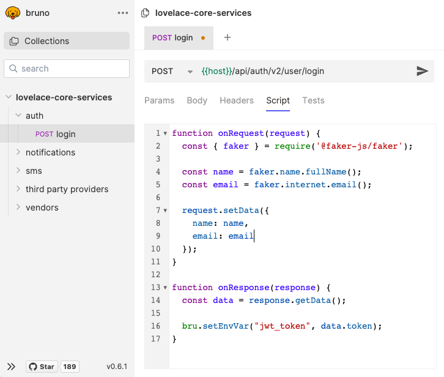

# Scripting

Bruno offers scripting support to help you to add additional functionality to the tool such as data generation, validation and integration with other tools and systems, including sending intermediate requests, parsing response data, updating environment variables etc..

The `onRequest` and `onResponse` functions allow you to add custom logic before sending the request and after receiving the request.   

