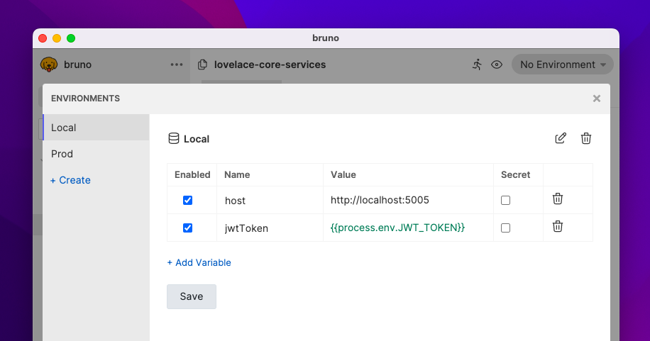

# Secrets Management

## DotEnv File

This approach is inspired by how usually developers manage secrets in their source code.

In this approach, you can store all your secrets in a `.env` file at the root of your collection folder.

Bruno will automatically load the secrets from this file and make them available to your collection via `process.env.<secret-name>`.



Your environment file at `environments/Local.bru` would lool like
```groovy
vars {
  host: http://localhost:5005
  jwtToken: {{process.env.JWT_TOKEN}}
}
```

And now you can safely checkin your collection to source control without worrying about exposing your secrets.
Don't forget to add `.env` to your `.gitignore` file.

You can store a `.env.sample` file in your collection folder to help other developers get started with the collection.