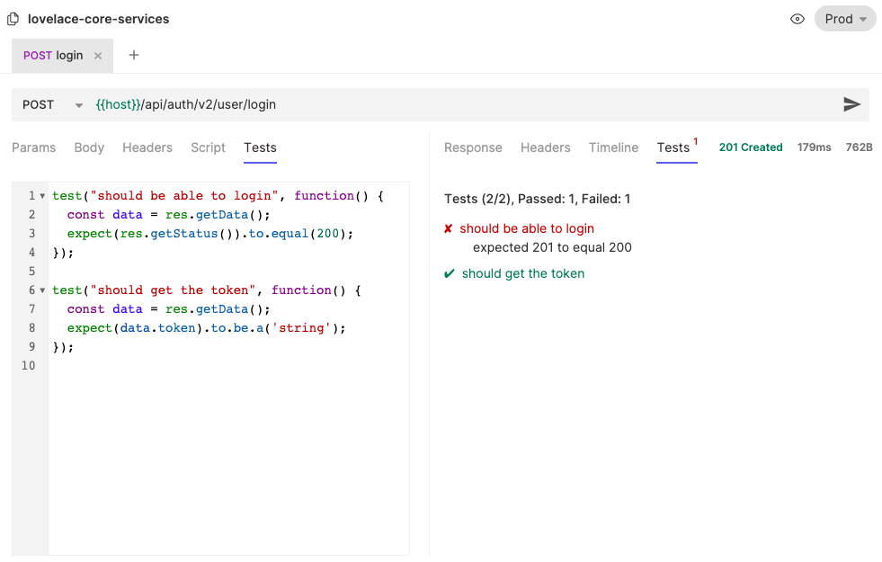

# Testing

Bruno supports writing automation test scripts in JavaScript for your API requests to assert its behaviour.

Some of the benefits include
- Increased efficiency: The tests can be run repeatedly, reducing the time and effort required for manual testing.
- Increased coverage: Automated tests can cover a larger range of scenarios and edge cases compared to manual testing.
- Continuous integration/continuous delivery (CI/CD): Automated API tests can be integrated into a CI/CD pipeline, ensuring that API changes are thoroughly tested before deployment.
- Easier maintenance: Automated tests can be easily updated as the API evolves, reducing the maintenance burden compared to manual tests.
- Easier regression testing: Automated tests can be easily repeated after changes are made to the API, reducing the time required for regression testing.

**Example:**
```javascript
test("should be able to login", function() {
  const data = res.getBody();
  expect(res.getStatus()).to.equal(200);
});

test("should receive the token", function() {
  const data = res.getBody();
  expect(data.token).to.be.a('string');
});
```

**Screenshot:**


