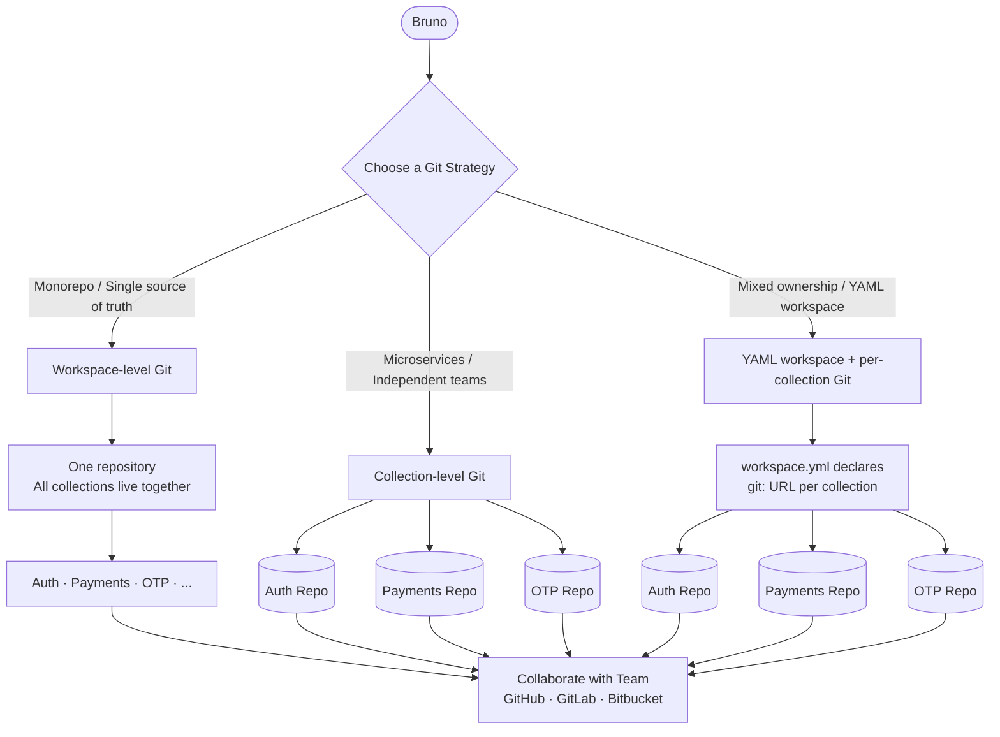

Bruno was designed to fit naturally into developer workflows. Some teams prefer to keep collections and workspaces alongside the code they are testing while others prefer to keep them in a separate repository to keep things isolated. The flexibility means it is really up to you and what fits your workflow best.

There are three strategies to consider when using Bruno with Git. Picking the right one early saves you from messy remote origin conflicts down the line.



---

## Workspace-level Git

With workspace-level Git, you initialize Git at the **workspace root**. Every collection inside that workspace is tracked under a single repository — one remote origin, one commit history, one place for your team to collaborate.

**Best suited for:**
- Monorepos where API collections live alongside your main source code
- Teams that want a single source of truth for all their API tests
- Projects where all services are tightly coupled and released together

**How it works:**

1. Open Bruno and go to your workspace.
2. Initialize Git at the workspace level (via the Git panel or CLI at the workspace directory).
3. All collections under that workspace are tracked automatically.
4. Push to GitHub, GitLab, Bitbucket, or any Git provider — your team can clone and immediately open the workspace in Bruno.


---

## Collection-level Git

With collection-level Git, you initialize Git **inside a specific collection**. Each collection has its own remote origin, completely independent of other collections.

**Best suited for:**
- Microservices architectures where each service is deployed and versioned independently
- Teams that own separate services (e.g. Auth team, Payments team, OTP team) and want isolated API test repositories
- Connecting a Bruno collection directly to an existing source code repository so it lives alongside that service

**How it works:**

1. Open a collection in Bruno.
2. Initialize Git inside that collection folder (or point it to an existing repo).
3. Each collection has its own remote — push, pull, and collaborate independently per service.


---

## Git-backed collections in a YAML workspace

This strategy lets you keep a single **YAML-based workspace** (`workspace.yml`) while giving each collection its own **independent Git remote**. The workspace itself may or may not be tracked in Git — what matters is that every collection declares its own `git:` URL inside `workspace.yml`. Bruno uses that URL to clone, pull, and track each collection separately.

This is the right approach when your collections are already living in separate repositories (owned by separate teams) but you still want one workspace file that ties them all together — without forcing everyone into a single monorepo.

**Best suited for:**
- Teams where each service already has its own repository and the collection lives alongside that service's code
- Workspaces that reference collections from multiple GitHub organizations or owners
- Users who want to share a `workspace.yml` so teammates can clone all collections from one starting point, without bundling everything into one repo

**How it works:**

1. Create or open a YAML-based workspace in Bruno (one that uses `workspace.yml`).
2. For each collection you want to back with Git, add a `git:` field in `workspace.yml` pointing to its remote URL:

```yaml
collections:
  - name: "Auth API"
    path: "collections/auth"
    git: "https://github.com/your-org/auth-collection"

  - name: "Payments API"
    path: "collections/payments"
    git: "https://github.com/your-org/payments-collection"

  - name: "OTP Service"
    path: "collections/otp"
    git: "https://github.com/your-org/otp-collection"
```

3. Each collection with a `git:` entry is treated as an independently cloned repository at its `path` location.
4. Collections that have a `git:` URL but have not been cloned yet appear **grayed out** in the Bruno sidebar, with a **Clone** button. Clicking it clones the collection from the remote into the specified `path`.
5. Once cloned, all standard Git operations (commit, push, pull, branch) work independently for each collection through Bruno's Git UI.

**Initializing an existing collection with a separate remote:**

If you already have a collection inside your workspace and want to connect it to its own remote (even after the workspace is already initialized), open that collection's Git panel and connect it to a remote origin. Bruno will then write the `git:` field back to `workspace.yml` automatically:

```yaml
collections:
  - name: "Coll"
    path: "collections/coll"
    git: "https://github.com/naman-bruno/coll"
```

<Info>
Only **YAML-based collections** support the `git:` field in `workspace.yml`. Filesystem-based collections (opened directly from a folder) do not use `workspace.yml` and are not affected by this pattern.
</Info>

<Warning>
If your workspace root is already tracked in Git (workspace-level Git), adding per-collection `git:` remotes creates **nested repositories** inside the workspace repo. This leads to the same nested `.git` conflicts described above. Choose one approach: either track everything from the workspace root, **or** use per-collection remotes declared in `workspace.yml`.
</Warning>

---

## Quick comparison

| | Workspace-level Git | Collection-level Git | YAML workspace + per-collection Git |
|---|---|---|---|
| **Git init location** | Workspace root | Inside each collection | Per collection, declared in `workspace.yml` |
| **Remote origins** | One | One per collection | One per collection |
| **Best for** | Monorepos, tightly coupled services | Microservices, independent teams | Mixed ownership — one workspace, many repos |
| **Team access** | Clone once, get all collections | Clone per service | Share `workspace.yml`; Bruno clones each collection |
| **Co-locate with source code** | Workspace alongside main repo | Collection alongside service repo | Collection alongside service repo |
| **Requires `workspace.yml`** | No | No | Yes |

---

<Info>
For step-by-step setup instructions, see [Collaboration via CLI](/git-integration/using-cli) or [Collaboration via GUI](/git-integration/using-gui).
</Info>
